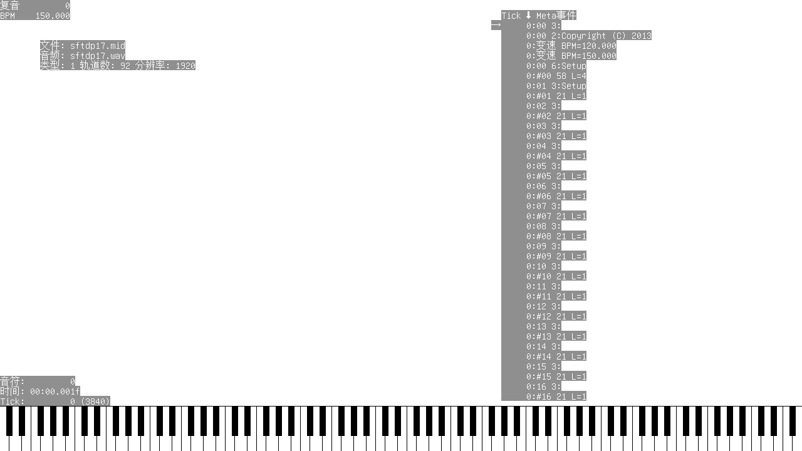
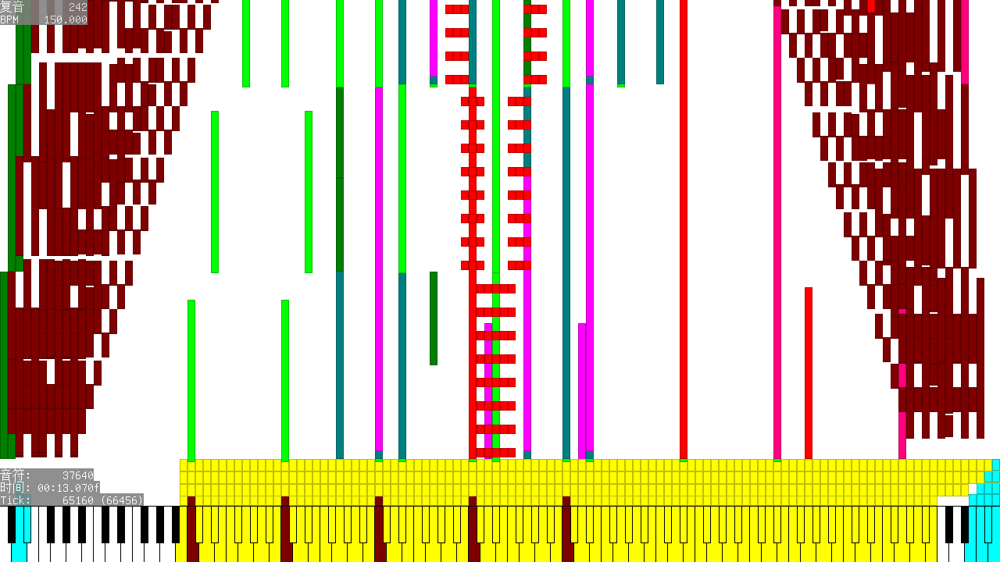
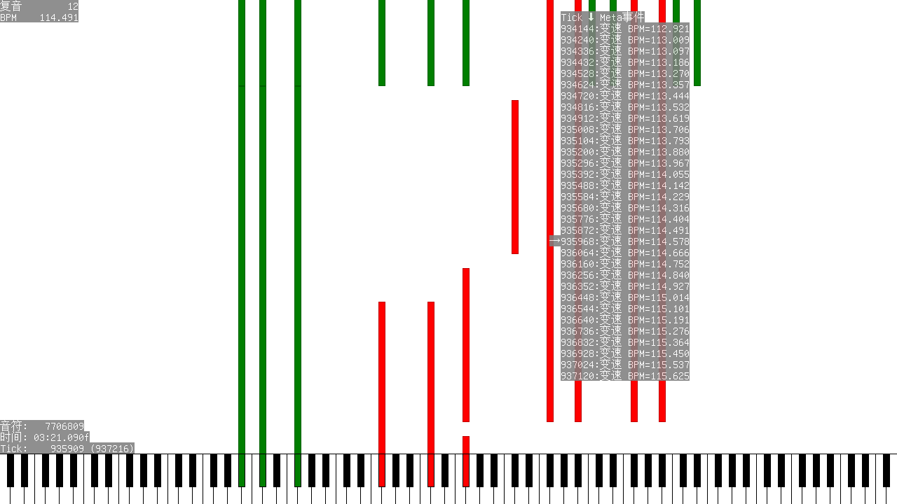
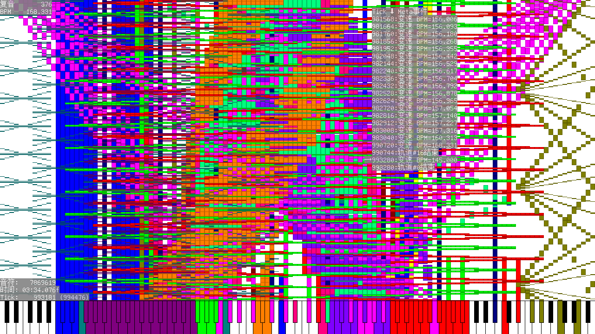

**better_midi_to_rawvideo**

## 编译:

下载 unifont，从`precompiled`复制`unifont-xx.x.xx.hex`到`make-font`，
然后运行`makefont.py`，最后将生成的`unifont.bin`复制到可执行文件同目录下。

> gcc \*.c -Ofast

- \-DUSE_MMAP: 使用 mmap 读取 midi 文件，否则使用 stdio
- \-DUSE_MPV: 由程序自行启动 mpv 播放(pipe+fork)
- \-DENABLE_TEXT: 启用文本绘制
- \-DENABLE_METALIST: 启用Meta事件列表

以上两选项皆不可在 Windows 使用

## 使用:

_目前修改参数只能通过编辑源码_  
`param.`

- `filename`: MIDI 文件名
- `audiofile`: 音频文件，`-DUSE_MPV`时传递给 mpv
- `frame_w`, `frame_h`: 画面的宽、高
- `fps_up`, `fps_dn`: fps 由`fps_up/fps_dn`计算得到
- `draw_barborder`: 音符条边框开关
- `draw_keyboard`: 钢琴键盘开关
  - `keyboard_h`: 键盘高度
  - `blackkey_h`: 黑键高度
- `screen_height`: 屏幕高度代表的 MIDI tick 数  
  表达式`param.frame_h - (param.draw_keyboard ? param.keyboard_h : 0)`使一像素恰好为一 MIDI tick.

_(别改太离谱的参数，根本没有越界检查的)_

一些其他平常不需要改的参数：

- `tckk_poolsize`: 预先分配内存的音符数量（MIDI 中同时按下的键的个数。）
- `bars_poolsize`: 预先分配的音符条数量（屏幕上的音符条，指每一段有边界的矩形，即无音符的部分也是音符条）
- `queu_poolsize`: 预先分配的某队列的元素数量，用于存放屏幕顶部传递到屏幕底部的事件。

以上数值若足够大，运行时就不需要 malloc 分配内存。

## 视频输出：

若不在编译时指定-DUSE_MPV，则程序向 stdout 输出 BGRA 视频数据，可以用 mpv 或 ffplay(ffmpeg)接收：  
mpv:

> ./a.out | mpv --demuxer=rawvideo --demuxer-rawvideo-{w=1920,h=1080,fps=60,size=8294400,format=BGRA}  
> \# 8294400 = 1920 \* 1080 \* 4  
> \# 可以用 --audio-file= 指定同时播放的音频文件

ffplay(ffmpeg):

> ./a.out | ffplay -f rawvideo -pixel_format bgra -video_size 1920x1080 -framerate 60 -i -

## 截图

